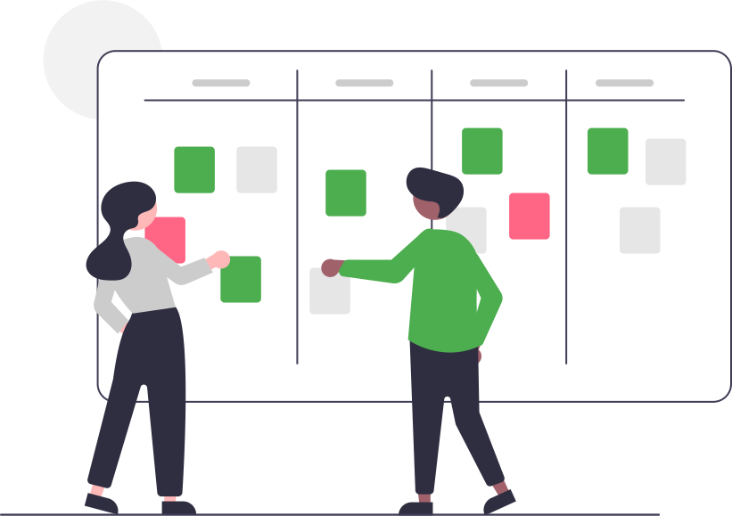
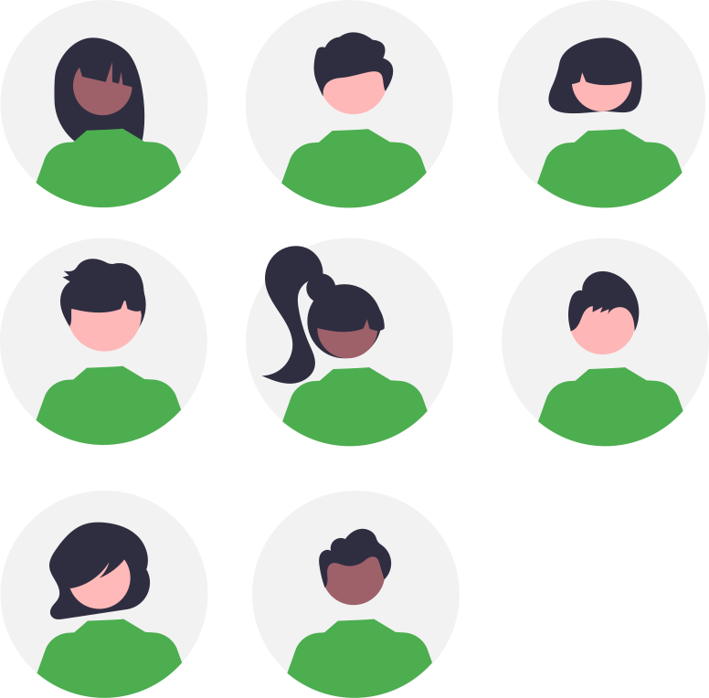
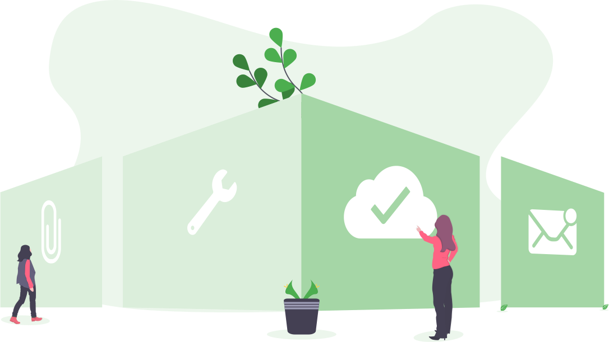

{: .center width=50%}

## Avertissement :

[{: align=left width=10%}](){target=_blank}[{: align=right width=10%}](mailto:)Ce site s'adresse au groupe des élèves de seconde du lycée Notre Dame du Mur qui suivent l'enseignement de découverte des Sciences de l'Ingénieur et mènent en parallèle un projet de Création et d'Innovation Technologique.

## Contenu de formation :

- **Explorer** à travers différentes activités courtes le domaine des Sciences de l'Ingénieur :

    - simulation et expérimentation de systèmes ;
    - programmation de cartes à microcontrôleur ;
    - modélisation et impression 3D...

{: .center width=50%}

- **Développer** en équipe tout au long de l'année un projet long tel que :

    - Créer un [jeu sur le thème de la cybersécurité](https://cyber.gouv.fr/actualites/au-college-et-au-lycee-former-a-la-cybersecurite-par-le-jeu){target="_blank"} ;
    - S'entrainer à programmer pour la [Nuit du c0de/](https://www.nuitducode.net/){target="_blank"} ;​
    - Construire et programmer des robots pour domino challenge et/ou [RoboFesta](https://www.robofesta.fr){target="_blank"} ;
    - Créer un véhicule électrique et un stand pour [Course en Cours](https://www.course-en-cours.com/fr/){target="_blank"} ;    
    - Développer des équipements pour connecter la serre du projet "planète verte" au collège Saint Augustin ;
    - Imaginer des solutions pour mesurer l'activité sportive dans le cadre du projet "bougeons ensemble" ;
    - Autres projets d'innovation...

[mail]: mailto:eric.madec@ecmorlaix.fr "eric.madec@ecmorlaix.fr"

***
<!--
!!! info "A LIRE :"

    - [Travailler PYTHON en prépa ECG](https://www.prepaplus.tv/blog/50/Travailler-python-en-prepa-ECG){target=_blank} ;

    - [LA LICENCE MIASHS Mathématiques et informatiques appliquées aux sciences humaines et sociales](https://www.onisep.fr/recherche?text=La+licence+MIASHS){target=_blank} ;

    - [Sortir de sa zone de confort pour apprendre afin de se réaliser](https://static.wixstatic.com/media/557f79_7cbdd28074e84e4882ec9314f46d5fb0~mv2.jpeg/v1/fill/w_1024,h_768,al_c,q_90/557f79_7cbdd28074e84e4882ec9314f46d5fb0~mv2.webp){target=_blank} ;
        source : <https://www.jeromefrugere.com/post/pourquoi-dit-on-qu-il-faut-se-faire-violence-pour-sortir-de-sa-zone-de-confort>
    
    - [Présentation SI](https://ericecmorlaix.github.io/si/){target=_blank}

    - [Présentation NSI](https://ericecmorlaix.github.io/nsi/){target=_blank}

***

## Du 26/03

=== "CONTENU DE SÉANCE"

    - Reprise des projets : Précision des sujets, recherche des problématiques fonctionnelles à résoudre, liste des tâches à réaliser, investigation de solutions technologiques...
    
    - Ressources :
        - [Le challenge robotique Brestois programmé le 15 mai](https://ericecmorlaix.github.io/1SI_2024-2025/Projet/Challenge_Robotique_SI_Brestois.pdf){target=_blank} ;
        - [Yahboom Building:bit starter kit](http://www.yahboom.net/study/Building_bit){target=_blank} : penser à [recharger la batterie](./yahboom/charge_batterie.pdf){target=_blank}, utiliser l'[éditeur Python recommandé](./yahboom/editeur_mu.pdf){target=_blank}, installer dans une carte [BBC micro:bit](https://ericecmorlaix.github.io/adn-Tutoriel_lab_si/IOT/BBC_microbit/){target=_blank} la bibliothèque [Micropython Building:bit](./yahboom/bibliotheque_building-bit.pdf){target=_blank}, réaliser [le montage d'une mini-voiture](./yahboom/bibliotheque_building-bit.pdf){target=_blank}, programmer avec les fonctions de [l'API MicroPython Building:bit](./yahboom/Buildingbit_MicroPython_API.pdf){target=_blank} ;
        - [4tronix bit:bot](https://4tronix.co.uk/blog/?p=1490){target=_blank} ;
         

=== "TRAVAIL À FAIRE"

    {: .center width=40%}

    - **Poursuivre** les travaux pour votre projet ;

***
## Le 30/01

=== "CONTENU DE SÉANCE"

    - Poursuite des projets : Précision des sujets, recherche des problématiques fonctionnelles à résoudre, liste des tâches à réaliser, investigation de solutions technologiques...
    
    - Ressources :
        - [Yahboom Building:bit starter kit](http://www.yahboom.net/study/Building_bit){target=_blank} : penser à [recharger la batterie](./yahboom/charge_batterie.pdf){target=_blank}, utiliser l'[éditeur Python recommandé](./yahboom/editeur_mu.pdf){target=_blank}, installer dans une carte [BBC micro:bit](https://ericecmorlaix.github.io/adn-Tutoriel_lab_si/IOT/BBC_microbit/){target=_blank} la bibliothèque [Micropython Building:bit](./yahboom/bibliotheque_building-bit.pdf){target=_blank}, réaliser [le montage d'une mini-voiture](./yahboom/bibliotheque_building-bit.pdf){target=_blank}, programmer avec les fonctions de [l'API MicroPython Building:bit](./yahboom/Buildingbit_MicroPython_API.pdf){target=_blank} ;
        - [4tronix bit:bot](https://4tronix.co.uk/blog/?p=1490){target=_blank} ;
         

=== "TRAVAIL À FAIRE"

    {: .center width=40%}

    - **Poursuivre** les travaux pour votre projet ;

***

## Le 23/01

- Présentation des spécialités [Sciences de l'Ingénieur](https://ericecmorlaix.github.io/si/){target=_blank} et [Numérique et Sciences Informatique](https://ericecmorlaix.github.io/nsi/){target=_blank} ;

***
## Le 16/01

=== "CONTENU DE SÉANCE"

    - Poursuite des projets : Précision des sujets, recherche des problématiques fonctionnelles à résoudre, liste des tâches à réaliser, investigation de solutions technologiques...

=== "TRAVAIL À FAIRE"

    {: .center width=40%}

    - **Poursuivre** les travaux pour votre projet ;

***
## Le 09/01

=== "CONTENU DE SÉANCE"

    - Organisation des projets : choix des sujets, recherche des problématiques fonctionnelles à résoudre, liste des tâches à réaliser,...

=== "TRAVAIL À FAIRE"

    {: .center width=40%}

    - **Poursuivre** les travaux pour votre projet ;

## Les 12 et 19/12

=== "CONTENU DE SÉANCE"

    - **​Prise en main** de la programmation des Lego Mindstorms EV3 avec l'application : "EV3 Classroom" :
        1. **Hello !** => expérimenter afin d'expliquer comment fonctionne la communication avec la brique depuis une tablette et depuis un PC...  ;​​​​​
        2. **Moteurs et capteurs** => programmer les différents capteurs et moteurs disponibles afin d'expliquer leur fonctionnement... ;
        3. **Se déplacer** => construire et programmer une base motrice afin d'expliquer le déplacement produit par les différentes instructions... ;
        4. **Fichier > Nouveau Projet**  =>  créer une nouvelle trame de programmation personnalisée et la partager...

=== "TRAVAIL À FAIRE"

    {: .center width=40%}

    - **Réfléchir** aux différents projets envisagés ;

    - **Relever** tous [les défis sur BBC micro:bit](./bbc_microbit){target=_blank} ;

    - **Finir**, avec votre code personnel, la programmation des objets connectés sur la [plateforme de France-IOI​​](https://amazon.quick-pi.org/){target="_blank"} et compléter votre notebook [Quick_Pi-Objets_connectes-Parcours_1.ipynb](https://nbviewer.org/urls/ericecmorlaix.github.io/adn-Tutoriel_lab_si/IOT/QuickPi/Quick_Pi-Objets_connectes-Parcours_1.ipynb){target=_blank} [:fontawesome-solid-download:](https://ericecmorlaix.github.io/adn-Tutoriel_lab_si/IOT/QuickPi/Quick_Pi-Objets_connectes-Parcours_1.ipynb){ .md-button .md-button--primary} ;

    - **Découvrir** d'avantage la [modélisation 3D avec BlocksCad](https://ericecmorlaix.github.io/adn-Tutoriel_lab_si/3D/BlocksCAD/){target="_blank"} ;
***
## Les 21 et 28/11

=== "CONTENU DE SÉANCE"

    - Recherche de pistes de projets et répartition en équipe ;
    - Synthèse partielle de la programmation des objets connectés sur la [plateforme de France-IOI​​](https://amazon.quick-pi.org/){target="_blank"} et avec le notebook [Quick_Pi-Objets_connectes-Parcours_1.ipynb](https://nbviewer.org/urls/ericecmorlaix.github.io/adn-Tutoriel_lab_si/IOT/QuickPi/Quick_Pi-Objets_connectes-Parcours_1.ipynb){target=_blank} ;[:fontawesome-solid-download:](https://ericecmorlaix.github.io/adn-Tutoriel_lab_si/IOT/QuickPi/Quick_Pi-Objets_connectes-Parcours_1.ipynb){ .md-button .md-button--primary}

    - **Programmer** une carte [BBC micro:bit](https://ericecmorlaix.github.io/adn-Tutoriel_lab_si/IOT/BBC_microbit/){target=_blank} afin de relever [les défis...](./bbc_microbit){target=_blank} ;    
    

=== "TRAVAIL À FAIRE"

    {: .center width=40%}

    - **Relever** tous [les défis sur BBC micro:bit](./bbc_microbit){target=_blank} ;

    - **Poursuivre**, avec votre code personnel, la programmation des objets connectés sur la [plateforme de France-IOI​​](https://amazon.quick-pi.org/){target="_blank"} et compléter progressivement votre notebook [Quick_Pi-Objets_connectes-Parcours_1.ipynb](https://nbviewer.org/urls/ericecmorlaix.github.io/adn-Tutoriel_lab_si/IOT/QuickPi/Quick_Pi-Objets_connectes-Parcours_1.ipynb){target=_blank} [:fontawesome-solid-download:](https://ericecmorlaix.github.io/adn-Tutoriel_lab_si/IOT/QuickPi/Quick_Pi-Objets_connectes-Parcours_1.ipynb){ .md-button .md-button--primary} ;

    - **Découvrir** d'avantage la [modélisation 3D avec BlocksCad](https://ericecmorlaix.github.io/adn-Tutoriel_lab_si/3D/BlocksCAD/){target="_blank"} ;

    - **Jouer** à résoudre le Casse Tête en ligne [ici (code JavaScript)](http://isn.si.lycee.ecmorlaix.fr/casseTete/){target=_blank} ou encore [là (code Scratch)](https://scratch.mit.edu/projects/179937454/){target=_blank} ;

***
## Le 07/11 (et 14/11 en autonomie)

=== "CONTENU DE SÉANCE"

    - Synthèse partielle de la programmation des objets connectés sur la [plateforme de France-IOI​​](https://amazon.quick-pi.org/){target="_blank"} et avec le notebook [Quick_Pi-Objets_connectes-Parcours_1.ipynb](https://nbviewer.org/urls/ericecmorlaix.github.io/adn-Tutoriel_lab_si/IOT/QuickPi/Quick_Pi-Objets_connectes-Parcours_1.ipynb){target=_blank} [:fontawesome-solid-download:](https://ericecmorlaix.github.io/adn-Tutoriel_lab_si/IOT/QuickPi/Quick_Pi-Objets_connectes-Parcours_1.ipynb){ .md-button .md-button--primary}

    - **Programmer** une carte [BBC micro:bit](https://ericecmorlaix.github.io/adn-Tutoriel_lab_si/IOT/BBC_microbit/){target=_blank} afin de relever [les défis...](./bbc_microbit){target=_blank} ;    
    

=== "TRAVAIL À FAIRE"

    {: .center width=40%}

    - **relever** tous [les défis sur BBC micro:bit](./bbc_microbit){target=_blank} ;

    - **Poursuivre**, avec votre code personnel, la programmation des objets connectés sur la [plateforme de France-IOI​​](https://amazon.quick-pi.org/){target="_blank"} et compléter progressivement votre notebook [Quick_Pi-Objets_connectes-Parcours_1.ipynb](https://nbviewer.org/urls/ericecmorlaix.github.io/adn-Tutoriel_lab_si/IOT/QuickPi/Quick_Pi-Objets_connectes-Parcours_1.ipynb){target=_blank} [:fontawesome-solid-download:](https://ericecmorlaix.github.io/adn-Tutoriel_lab_si/IOT/QuickPi/Quick_Pi-Objets_connectes-Parcours_1.ipynb){ .md-button .md-button--primary} ;

    - **Découvrir** d'avantage la [modélisation 3D avec BlocksCad](https://ericecmorlaix.github.io/adn-Tutoriel_lab_si/3D/BlocksCAD/){target="_blank"} ;

    - **Jouer** à résoudre le Casse Tête en ligne [ici (code JavaScript)](http://isn.si.lycee.ecmorlaix.fr/casseTete/){target=_blank} ou encore [là (code Scratch)](https://scratch.mit.edu/projects/179937454/){target=_blank} ;
***
## Les 10 et 17/10

=== "CONTENU DE SÉANCE"

    - Synthèse partielle de la programmation des objets connectés sur la [plateforme de France-IOI​​](https://amazon.quick-pi.org/){target="_blank"} et avec le notebook [Quick_Pi-Objets_connectes-Parcours_1.ipynb](https://nbviewer.org/urls/ericecmorlaix.github.io/adn-Tutoriel_lab_si/IOT/QuickPi/Quick_Pi-Objets_connectes-Parcours_1.ipynb){target=_blank} [:fontawesome-solid-download:](https://ericecmorlaix.github.io/adn-Tutoriel_lab_si/IOT/QuickPi/Quick_Pi-Objets_connectes-Parcours_1.ipynb){ .md-button .md-button--primary}

    - **S'initier** à la modélisation 3D avec [BlocksCAD](https://ericecmorlaix.github.io/adn-Tutoriel_lab_si/3D/BlocksCAD/){target="_blank"} ;

    - Evocation du projet **"Couronne de l'Avent"** :

    

    <iframe width="560" height="315" src="https://www.youtube-nocookie.com/embed/RwjsnJRihXg?si=Thi1l0IKc9Zej4Pv" title="YouTube video player" frameborder="0" allow="accelerometer; autoplay; clipboard-write; encrypted-media; gyroscope; picture-in-picture; web-share" allowfullscreen></iframe>
    

    > Quelles solutions pour les bougies ?
    

=== "TRAVAIL À FAIRE"

    {: .center width=40%}

    - **Poursuivre**, avec votre code personnel, la programmation des objets connectés sur la [plateforme de France-IOI​​](https://amazon.quick-pi.org/){target="_blank"} et compléter progressivement votre notebook [Quick_Pi-Objets_connectes-Parcours_1.ipynb](https://nbviewer.org/urls/ericecmorlaix.github.io/adn-Tutoriel_lab_si/IOT/QuickPi/Quick_Pi-Objets_connectes-Parcours_1.ipynb){target=_blank} [:fontawesome-solid-download:](https://ericecmorlaix.github.io/adn-Tutoriel_lab_si/IOT/QuickPi/Quick_Pi-Objets_connectes-Parcours_1.ipynb){ .md-button .md-button--primary} ;

    - **Découvrir** d'avantage la [modélisation 3D avec BlocksCad](https://ericecmorlaix.github.io/adn-Tutoriel_lab_si/3D/BlocksCAD/){target="_blank"} ;

    - **Jouer** à résoudre le Casse Tête en ligne [ici (code JavaScript)](http://isn.si.lycee.ecmorlaix.fr/casseTete/){target=_blank} ou encore [là (code Scratch)](https://scratch.mit.edu/projects/179937454/){target=_blank} ;

***
## Le 03/10

=== "CONTENU DE SÉANCE"

    - Remédiation [prise en main](https://ec-morlaix.github.io/info/priseenmain/){:target="_blank"} de l'iPad et de l'E.N.T. ECA.M ;
    - Synthèse partielle (Mélodie, Alternance, Schow lumineux 1) de la programmation des objets connectés sur la [plateforme de France-IOI​​](https://amazon.quick-pi.org/){target="_blank"} et avec le notebook [Quick_Pi-Objets_connectes-Parcours_1.ipynb](https://nbviewer.org/urls/ericecmorlaix.github.io/adn-Tutoriel_lab_si/IOT/QuickPi/Quick_Pi-Objets_connectes-Parcours_1.ipynb){target=_blank} [:fontawesome-solid-download:](https://ericecmorlaix.github.io/adn-Tutoriel_lab_si/IOT/QuickPi/Quick_Pi-Objets_connectes-Parcours_1.ipynb){ .md-button .md-button--primary}    

=== "TRAVAIL À FAIRE"

    {: .center width=40%}

    - **Poursuivre**, avec votre code personnel, la programmation des objets connectés sur la [plateforme de France-IOI​​](https://amazon.quick-pi.org/){target="_blank"} et compléter progressivement votre notebook [Quick_Pi-Objets_connectes-Parcours_1.ipynb](https://nbviewer.org/urls/ericecmorlaix.github.io/adn-Tutoriel_lab_si/IOT/QuickPi/Quick_Pi-Objets_connectes-Parcours_1.ipynb){target=_blank} [:fontawesome-solid-download:](https://ericecmorlaix.github.io/adn-Tutoriel_lab_si/IOT/QuickPi/Quick_Pi-Objets_connectes-Parcours_1.ipynb){ .md-button .md-button--primary} ;    

***
## Le 26/09

=== "CONTENU DE SÉANCE"

    - Remédiation [Prise en main d'Obsidian](https://ericecmorlaix.github.io/adn-Tutoriel_Obsidian/){target="_blank"} pour communiquer un compte rendu ;    

    - **S'initier** à la programmation des objets connectés avec la carte [**QuickPi**](https://quick-pi.org/){target="_blank"} :
        - à partir de la plateforme [**Castor Informatique France-IOI**](https://concours.castor-informatique.fr/){target="_blank"}​ en utilisant le code `5yjjjh8i` fourni​​​ pour débuter le **Parcours_1** ;
        - **regardez** la [vidéo de prise en main de l'interface](https://web.microsoftstream.com/video/3d15c5a0-a510-4553-a45c-892de0227100){target="_blank"} ;
        - ==**notez, transmettez par [mail] et conservez** votre code personnel pour ce Parcours pour y retourner d'une fois sur l'autre== ;

=== "TRAVAIL À FAIRE"

    {: .center width=40%}    

    - **Poursuivre**, avec votre code personnel, la programmation des objets connectés sur la [plateforme de France-IOI​​](https://amazon.quick-pi.org/){target="_blank"} ;

    - Télécharger puis compléter progressivement le notebook [Quick_Pi-Objets_connectes-Parcours_1.ipynb](https://nbviewer.org/urls/ericecmorlaix.github.io/adn-Tutoriel_lab_si/IOT/QuickPi/Quick_Pi-Objets_connectes-Parcours_1.ipynb){target=_blank} [:fontawesome-solid-download:](https://ericecmorlaix.github.io/adn-Tutoriel_lab_si/IOT/QuickPi/Quick_Pi-Objets_connectes-Parcours_1.ipynb){ .md-button .md-button--primary} ;

    - Explorer d'avantage [les fonctionnalités de l'application multiplateforme Obsidian](https://ericecmorlaix.github.io/adn-Tutoriel_Obsidian/){target=_blank}

***
-->

## Le 17/09

=== "CONTENU DE SÉANCE"

    ### Présentation de l'environnement de travail :
    
    - Dépot [GitHub](https://github.com/ericECmorlaix/2SI-CIT_2024-2025){target="_blank"} qui héberge ce site ;
    - Organisation du Labo de SI ;
    - Applications iPad utiles : **Carnets**, ...   

    ### Prise en main des [notebook jupyter](https://ericecmorlaix.github.io/adn-Tutoriel_lab_si/IDE/notebook/){target="_blank"} pour communiquer un compte rendu :

    {: .center width=40%}

    - **compléter** dans un navigateur une fiche d'informations à partir de son lien [Capytale n°8827-3935418](https://capytale2.ac-paris.fr/web/c/8827-3935418){target="_blank"} ou [Basthon](https://notebook.basthon.fr/?ipynb=eJztVt1u2zYUfpUz5cItYMn_TeR4DrauwwJka7q2A4Y4CCjyyGZCkSpJxTGCvMsuk0fYtV9sh_JPnQAbltwNmGHIPCTP3_d9pHwbcVTKRcOz26hAzwTzLBre3jXr-Qu_KDEaRgWzV8LMddSMnKksD3N7e_BOO5RTjQVqDwJBLB-4qa7Rehqjg49couY0oDXVONbT5YOWWNnorvn8bHtwLCiPzCVnXhoNw4me6Bh-MQUMIUmSYJxa1Lv2W8Wcw4090SHMW4QvFcIlQs6koy-ghm6724vp0Ycj-FAZST_vl3_CUXDa8f1QoQJ0HgoqoLTmEqnxhrHUp19VdQQ_MO1CBgXCFExqpLnf0K7niuWDl2i3kV-IxSkZX0Kdlw0mgc-MdDLA7Cp5bQPa-Jibp2TILRmhe4fcaJp_2u4Gqga6cnlPcRcBM_t44ws7-ExpF84v74tNEiYLtNQNIVSJLUYxnAWKRbXdfv6KG6UwVO6pFkc9lcwy7WfL-2CoBhMWA--iUVEWSXKcY0Z8LR9cIIoQ4bgN93qlpG_OZMGm-LxEn389qZMgrJ1xNzII6UqjZaYCMRZUXcfrF0P2HXVw74BdG2nB4pRZOnGgGIwYeGan6L-dRJli-moSwcxiTubM-9INW62FqXyVZNha7C8w67z_vpP3J9H4WlIIU8uG-sJRi42b4WgQVFS5AC5jtsq6_CNkIqZcrfNyI8CcVT6WCnJjib5aal_FVZ-tHwkyQuXoadeRt5XzKKIhDfAJBtwI3O0_tySC49OFnxmdBFwVWxDopbEefvr088lEh-erRqMx4kQX2vEol9PK4niiRzK3jOiYS-FnhMngTTsAROdjFhDrdQZkOst34JrP50kNWYaxNtyYK4kJN0ULiwzFYxDBS6-QnH831SdyAAIVDYQK0dJynTwzVqClTSE1U8rMacw4tYzUGVLBh0BImuB1CFzJMjPEbzy3JN9DgpHbRUlgxQUKyQ5hurDGcVPSWim5p0ZjqeP1cJMir-hu5xZRj0etFQgBDgKGszLQOCbl_DuhnPzDfQ4xBLyqkqSR5DaIaNTaSQL0obStNSGj1pohIus1cYw3yKuw8YLeHtpHw04zoiLKyq_eS6vxRhir3XhBJ7xS_m_ctwrDG98iSKUmz9ET-SRBMWCyS-QemIf2Tac7EIO0PaaotefMFyo4_q-o_4ii6Ip5dK_enT__pv2Iiu63wsgm1O_n80choyu0GpUrkQdLEwDkU9bC6lGYtbYu1gsrxUEvSZMOvOnHmfShRhmqLW0gKUSZMTejzWna2--kvXaa7ffTfdFHlh609wfdPM8zkfMBTzv9tJMPxAHm2O8jtg863YNc8F6ap_QHJrqj0DoLNzGjc9D_alwUUhtK1b37C466epU){target="_blank"} ;
    - **Faire** `Fichier > Enregistrer sous...` pour télécharger sur l'iPad en local un fichier copie de votre notebook complété ;
    - **renommer** le au format `Nom_Prenom-fiche.ipynb` ;    

    {: .center width=30%}

    - **installer** l'application [Carnets](https://holzschu.github.io/Carnets_Jupyter/){target="_blank"} depuis la bibliothèque d'applications **Eleve** ;
    - **déplacer**  votre fichier `.ipynb` depuis le dossier `Téléchargements` vers un nouveau dossier nommé `SI` dans le dossier `Carnets` ;
    - **ouvrir** votre notebook avec `Carnets` pour l'augmenter... ;
    - **transmettre** votre fichier `.ipynb` en pièce jointe d'un mail à l'adresse [eric.madec@ecmorlaix.fr](mailto:eric.madec@ecmorlaix.fr) ;

=== "TRAVAIL À FAIRE"

    {: .center width=40%}

    - **Découvrir** plus avant les fonctionnalités d'écriture en MarkDown dans les [notebook jupyter](https://ericecmorlaix.github.io/adn-Tutoriel_lab_si/IDE/notebook/){target=_blank} pour **améliorer** votre fiche d'informations et la **retransmettre** par [mail] ;

<!--  

***

<!-- ## Du 07/03

=== "CONTENU DE SÉANCE"

    - Développement des projets respectifs...

=== "TRAVAIL À FAIRE"

    {: .center width=40%}

    - **Faire** la [mise à jour d'Obsidian pour découvrir les canvas](https://ericecmorlaix.github.io/adn-Tutoriel_Obsidian/7-Options_Plugins/#canvas){target=_blank} ;
    - **Finir** les [activités d'escape game pour l'accueil des troisièmes](https://ericecmorlaix.github.io/accueil_3/){target=_blank} ;
    - **Poursuivre**, avec votre code personnel, la programmation des objets connectés sur la [plateforme de France-IOI​​](https://amazon.quick-pi.org/){target="_blank"} et compléter progressivement votre notebook [Quick_Pi-Objets_connectes-Parcours_1.ipynb](https://nbviewer.org/urls/ericecmorlaix.github.io/2SI_2022-2023/Quick_Pi-Objets_connectes-Parcours_1.ipynb){target=_blank} [:fontawesome-solid-download:](https://ericecmorlaix.github.io/2SI_2022-2023/Quick_Pi-Objets_connectes-Parcours_1.ipynb){ .md-button .md-button--primary} ;
    - **Découvrir** d'avantage la modélisation 3D avec [BlocksCad](./blocksCAD){target="_blank"} et [Onshape](./Onshape){target="_blank"} ;
    - **Programmer** une carte [BBC micro:bit](./bbc_microbit){target=_blank} ;
    - **Poursuivre** en robotique avec les Lego Mindstorms EV3 et l'application : "EV3 Classroom" ;

***
## Le 28/02

=== "CONTENU DE SÉANCE"

    - **Réaliser** les [activités d'escape game pour l'accueil des troisièmes](https://ericecmorlaix.github.io/accueil_3/){target=_blank} ;

=== "TRAVAIL À FAIRE"

    - **Faire** la [mise à jour d'Obsidian pour découvrir les canvas](https://ericecmorlaix.github.io/adn-Tutoriel_Obsidian/7-Options_Plugins/#canvas){target=_blank} ;

***
## Du 24/01 au 06/02

=== "CONTENU DE SÉANCE"

    - Développement des projets respectifs...

=== "TRAVAIL À FAIRE"

    {: .center width=40%}

    - Explorer d'avantage [les fonctionnalités de l'application multiplateforme Obsidian](https://ericecmorlaix.github.io/adn-Tutoriel_Obsidian/){target=_blank} ;
    - **Poursuivre**, avec votre code personnel, la programmation des objets connectés sur la [plateforme de France-IOI​​](https://amazon.quick-pi.org/){target="_blank"} et compléter progressivement votre notebook [Quick_Pi-Objets_connectes-Parcours_1.ipynb](https://nbviewer.org/urls/ericecmorlaix.github.io/2SI_2022-2023/Quick_Pi-Objets_connectes-Parcours_1.ipynb){target=_blank} [:fontawesome-solid-download:](https://ericecmorlaix.github.io/2SI_2022-2023/Quick_Pi-Objets_connectes-Parcours_1.ipynb){ .md-button .md-button--primary} ;
    - **Découvrir** d'avantage la modélisation 3D avec [BlocksCad](./blocksCAD){target="_blank"} et [Onshape](./Onshape){target="_blank"} ;
    - **Programmer** une carte [BBC micro:bit](./bbc_microbit){target=_blank} ;
    - **Poursuivre** en robotique avec les Lego Mindstorms EV3 et l'application : "EV3 Classroom" ;

***
## Les 10 et 17/01

=== "CONTENU DE SÉANCE"

    - **​Prise en main** de la programmation des Lego Mindstorms EV3 avec l'application : "EV3 Classroom" :
        1. **Hello !** => expérimenter afin d'expliquer comment fonctionne la communication avec la brique depuis une tablette et depuis un PC...  ;​​​​​
        2. **Moteurs et capteurs** => programmer les différents capteurs et moteurs disponibles afin d'expliquer leur fonctionnement... ;
        3. **Se déplacer** => construire et programmer une base motrice afin d'expliquer le déplacement produit par les différentes instructions... ;
        4. **Fichier > Nouveau Projet**  =>  créer une nouvelle trame de programmation personnalisée et la partager...

=== "TRAVAIL À FAIRE"

    {: .center width=40%}

    - Explorer d'avantage [les fonctionnalités de l'application multiplateforme Obsidian](https://ericecmorlaix.github.io/adn-Tutoriel_Obsidian/){target=_blank}

    - **Poursuivre**, avec votre code personnel, la programmation des objets connectés sur la [plateforme de France-IOI​​](https://amazon.quick-pi.org/){target="_blank"} et compléter progressivement votre notebook [Quick_Pi-Objets_connectes-Parcours_1.ipynb](https://nbviewer.org/urls/ericecmorlaix.github.io/2SI_2022-2023/Quick_Pi-Objets_connectes-Parcours_1.ipynb){target=_blank} [:fontawesome-solid-download:](https://ericecmorlaix.github.io/2SI_2022-2023/Quick_Pi-Objets_connectes-Parcours_1.ipynb){ .md-button .md-button--primary} ;

    - **Découvrir** d'avantage la modélisation 3D avec [BlocksCad](./blocksCAD){target="_blank"} et [Onshape](./Onshape){target="_blank"} ;

    - **Programmer** une carte [BBC micro:bit](./bbc_microbit){target=_blank}

## Le 06/12

=== "CONTENU DE SÉANCE"

    - Modélisation 3D avec [Onshape](./Onshape)  

=== "TRAVAIL À FAIRE"

    {: .center width=40%}

    - Explorer d'avantage [les fonctionnalités de l'application multiplateforme Obsidian](https://ericecmorlaix.github.io/adn-Tutoriel_Obsidian/){target=_blank}

    - **Poursuivre**, avec votre code personnel, la programmation des objets connectés sur la [plateforme de France-IOI​​](https://amazon.quick-pi.org/){target="_blank"} et compléter progressivement votre notebook [Quick_Pi-Objets_connectes-Parcours_1.ipynb](https://nbviewer.org/urls/ericecmorlaix.github.io/2SI_2022-2023/Quick_Pi-Objets_connectes-Parcours_1.ipynb){target=_blank} [:fontawesome-solid-download:](https://ericecmorlaix.github.io/2SI_2022-2023/Quick_Pi-Objets_connectes-Parcours_1.ipynb){ .md-button .md-button--primary} ;
    - **Découvrir** d'avantage la [modélisation 3D avec BlocksCad](./blocksCAD){target="_blank"} ;
    - **Programmer** une carte [BBC micro:bit](./bbc_microbit){target=_blank}

***
## Le 29/11

=== "CONTENU DE SÉANCE"

    - Projet de création et d'innovation technologique -> ==Initier le "product backlog" de votre projet==;    

=== "TRAVAIL À FAIRE"

    {: .center width=40%}

    - Explorer d'avantage [les fonctionnalités de l'application multiplateforme Obsidian](https://ericecmorlaix.github.io/adn-Tutoriel_Obsidian/){target=_blank}

    - **Poursuivre**, avec votre code personnel, la programmation des objets connectés sur la [plateforme de France-IOI​​](https://amazon.quick-pi.org/){target="_blank"} et compléter progressivement votre notebook [Quick_Pi-Objets_connectes-Parcours_1.ipynb](https://nbviewer.org/urls/ericecmorlaix.github.io/2SI_2022-2023/Quick_Pi-Objets_connectes-Parcours_1.ipynb){target=_blank} [:fontawesome-solid-download:](https://ericecmorlaix.github.io/2SI_2022-2023/Quick_Pi-Objets_connectes-Parcours_1.ipynb){ .md-button .md-button--primary} ;
    - **Découvrir** d'avantage la [modélisation 3D avec BlocksCad](./blocksCAD){target="_blank"} ;
    - **Programmer** une carte [BBC micro:bit](./bbc_microbit){target=_blank}

***

    

=== "TRAVAIL À FAIRE"

    {: .center width=40%}

    - Explorer d'avantage [les fonctionnalités de l'application multiplateforme Obsidian](https://ericecmorlaix.github.io/adn-Tutoriel_Obsidian/){target=_blank}

    - **Poursuivre**, avec votre code personnel, la programmation des objets connectés sur la [plateforme de France-IOI​​](https://amazon.quick-pi.org/){target="_blank"} et compléter progressivement votre notebook [Quick_Pi-Objets_connectes-Parcours_1.ipynb](https://nbviewer.org/urls/ericecmorlaix.github.io/2SI_2022-2023/Quick_Pi-Objets_connectes-Parcours_1.ipynb){target=_blank} [:fontawesome-solid-download:](https://ericecmorlaix.github.io/2SI_2022-2023/Quick_Pi-Objets_connectes-Parcours_1.ipynb){ .md-button .md-button--primary} ;

    - **Découvrir** d'avantage la [modélisation 3D avec BlocksCad](./blocksCAD){target="_blank"} ;

****
## Le 08/11

=== "CONTENU DE SÉANCE"

    - Synthèse "Instrument",""Show lumineux 2"", "Avertisseur"  de la programmation des objets connectés sur la [plateforme de France-IOI​​](https://amazon.quick-pi.org/){target="_blank"} et avec le notebook [Quick_Pi-Objets_connectes-Parcours_1.ipynb](https://nbviewer.org/urls/ericecmorlaix.github.io/2SI_2022-2023/Quick_Pi-Objets_connectes-Parcours_1.ipynb){target=_blank} [:fontawesome-solid-download:](https://ericecmorlaix.github.io/2SI_2022-2023/Quick_Pi-Objets_connectes-Parcours_1.ipynb){ .md-button .md-button--primary} ;

    - Synthèse Modélisation 3D avec [BlocksCAD](./blocksCAD){target="_blank"} -> ==**Défin n°2 : Modéliser un support imprimable**== ;

    - Présentation d'un [tutoriel pour l'application multiplateforme Obsidian](https://ericecmorlaix.github.io/adn-Tutoriel_Obsidian/){target=_blank} -> ==Avec l'aide de ShortCut d'automatisation [Capter idée](https://www.icloud.com/shortcuts/40a6686913734aaca605dc1081791336) et [Partager Média](https://www.icloud.com/shortcuts/6285c561258343bfb06b6b58a1956258) collecter des données sur une note du jour dans votre coffre d'Obsidian localisé sur votre iPad== ;

    - Projets...

=== "TRAVAIL À FAIRE"

    {: .center width=40%}

    - Explorer d'avantage [les fonctionnalités de l'application multiplateforme Obsidian](https://ericecmorlaix.github.io/adn-Tutoriel_Obsidian/){target=_blank}

    - **Poursuivre**, avec votre code personnel, la programmation des objets connectés sur la [plateforme de France-IOI​​](https://amazon.quick-pi.org/){target="_blank"} et compléter progressivement votre notebook [Quick_Pi-Objets_connectes-Parcours_1.ipynb](https://nbviewer.org/urls/ericecmorlaix.github.io/2SI_2022-2023/Quick_Pi-Objets_connectes-Parcours_1.ipynb){target=_blank} [:fontawesome-solid-download:](https://ericecmorlaix.github.io/2SI_2022-2023/Quick_Pi-Objets_connectes-Parcours_1.ipynb){ .md-button .md-button--primary} ;

    - **Découvrir** d'avantage la [modélisation 3D avec BlocksCad](./blocksCAD){target="_blank"} ;

    - **Jouer** à résoudre le Casse Tête en ligne [ici (code JavaScript)](http://isn.si.lycee.ecmorlaix.fr/casseTete/){target=_blank} ou encore [là (code Scratch)](https://scratch.mit.edu/projects/179937454/){target=_blank} ;
***
## Le 18/10

=== "CONTENU DE SÉANCE"

    - Synthèse "Quelle direction ?" de la programmation des objets connectés sur la [plateforme de France-IOI​​](https://amazon.quick-pi.org/){target="_blank"} et avec le notebook [Quick_Pi-Objets_connectes-Parcours_1.ipynb](https://nbviewer.org/urls/ericecmorlaix.github.io/2CIT_2022-2023/Quick_Pi-Objets_connectes-Parcours_1.ipynb){target=_blank} [:fontawesome-solid-download:](https://ericecmorlaix.github.io/2CIT_2022-2023/Quick_Pi-Objets_connectes-Parcours_1.ipynb){ .md-button .md-button--primary} ;

    - Modélisation 3D avec [BlocksCAD](./blocksCAD){target="_blank"} -> ==**Défin n°2 : Modéliser un support imprimable**== ;

    - Découverte de l'application multiplateforme [Obsidian](https://obsidian.md/){target=_blank} -> ==Créer un coffre d'Obsidian localisé sur votre iPad pour prendre des notes au format `note.md` et y apairer vos fichiers `fiche.ipynb` avec des `fiche.md` grace à jupytext dans Carnets== ;

    
<iframe width="560" height="315" src="https://www.youtube-nocookie.com/embed/WRkvdtm7ybw" title="YouTube video player" frameborder="0" allow="accelerometer; autoplay; clipboard-write; encrypted-media; gyroscope; picture-in-picture" allowfullscreen></iframe>

    - Pistes de projets...

=== "TRAVAIL À FAIRE"

    {: .center width=40%}

    ??? tip "Comment se construire un second cerveau avec Obsidian en mode [Zettelkasten](https://fr.wikipedia.org/wiki/Zettelkasten)"

        
<iframe width="560" height="315" src="https://www.youtube-nocookie.com/embed/B9BLia6FN4s" title="YouTube video player" frameborder="0" allow="accelerometer; autoplay; clipboard-write; encrypted-media; gyroscope; picture-in-picture" allowfullscreen></iframe>

        
<iframe width="560" height="315" src="https://www.youtube-nocookie.com/embed/upyTEnzqJwk" title="YouTube video player" frameborder="0" allow="accelerometer; autoplay; clipboard-write; encrypted-media; gyroscope; picture-in-picture" allowfullscreen></iframe>

        
<iframe width="560" height="315" src="https://www.youtube-nocookie.com/embed/beCbmjygkAg" title="YouTube video player" frameborder="0" allow="accelerometer; autoplay; clipboard-write; encrypted-media; gyroscope; picture-in-picture" allowfullscreen></iframe>

***

## Le 04/10

=== "CONTENU DE SÉANCE"

    - Remédiation [Prise en main des notebook jupyter](./notebook) pour communiquer un compte rendu ;

    - **Découvrir** [Ces 12 "jobs du futur" qui vont exploser](https://start.lesechos.fr/travailler-mieux/classements/ces-12-jobs-du-futur-qui-vont-exploser-1174984?xtor=CS2-11) ;

    - **S'initier** à la programmation des objets connectés avec la carte [**QuickPi**](https://quick-pi.org/){target="_blank"} :
        - à partir de la plateforme [**Castor Informatique France-IOI**](https://concours.castor-informatique.fr/){target="_blank"}​ en utilisant le code `9q8vvj6s` fourni​​​ pour débuter le **Parcours_1** ;
        - **regardez** la [vidéo de prise en main de l'interface](https://web.microsoftstream.com/video/3d15c5a0-a510-4553-a45c-892de0227100){target="_blank"} ;
        - ==**notez, transmettez-moi et conservez** votre code personnel pour ce Parcours pour y retourner d'une fois sur l'autre== ;

=== "TRAVAIL À FAIRE"

    {: .center width=40%}

    - **Relire** [Ces 12 "jobs du futur" qui vont exploser](https://start.lesechos.fr/travailler-mieux/classements/ces-12-jobs-du-futur-qui-vont-exploser-1174984?xtor=CS2-11) ;

    - **Poursuivre**, avec votre code personnel, la programmation des objets connectés sur la [plateforme de France-IOI​​](https://amazon.quick-pi.org/){target="_blank"} ;

    - Télécharger puis compléter progressivement le notebook [Quick_Pi-Objets_connectes-Parcours_1.ipynb](https://nbviewer.org/urls/ericecmorlaix.github.io/2CIT_2022-2023/Quick_Pi-Objets_connectes-Parcours_1.ipynb){target=_blank} [:fontawesome-solid-download:](https://ericecmorlaix.github.io/2CIT_2022-2023/Quick_Pi-Objets_connectes-Parcours_1.ipynb){ .md-button .md-button--primary}

***

## Le 27/09

=== "CONTENU DE SÉANCE"

    ### Présentation de l'environnement de travail :
    
    - Dépot [GitHub](https://github.com/ericECmorlaix/2CIT_2022-2023){target="_blank"} qui héberge ce site ;
    - Organisation du Labo de SI ;
    - Applications iPad utiles : **Carnets**, **Obsidian**, Mindomo, Sketchbook, **EV3 Classroom**, OnShape, ...   

    ### Prise en main des [notebook jupyter](./notebook) pour communiquer un compte rendu :

    {: .center width=40%}

    - **compléter** dans un navigateur une [fiche d'informations à partir de son lien **basthon**](https://notebook.basthon.fr/?ipynb=eJztVttu4zYQ_ZWp8uBdwJKv2USO66DdYtEAaTfb3RYo4iCgyJHFhCK1JBXHCPIvfUw-oc_-sQ5lx-ukaNHkqShqGDaH5NzOnBnpJuKolItGpzdRiZ4J5lk0urltN_vnflFhNIpKZi-FmeuoHTlTWx72dnbgneQFgkCwqB3KmcYStXdQ0R1Qre3NcEss77mpr9D6oOTgI5eoOS3oTLWO9Gx5ryXWNrptPz-YHTgS5EfmkjMvjR5NdQw_mhJGkCRJEE4oym35rWLO4YM81cHGW4TPNcIFQs6koy-ghn6334_pZwCH8KE2kv7eL3-Hw6C0pfuhRgXoPJRGQ2XNBVLWLWMpSd-ERHrfMe2CBwXClExqpL1f0K73yuW9l2g3ll8IxAkJn0OcFy0mgRdGOhkwdrW8svjnwjythNxUImTvkBtN-0_TfYCqha5a3pHdRcDMPr74wgyOKRS3cH55V6Jbu2GyREv5EEa12KAUw2kosqg3989ecaMUhtg9RePIQMUs075Y3gVBtZiwGCovWjWlJ4mNc8yoYst7F0pFmHDcmHsNo-Dnq1NZshk-z9HPPx03ThDWyrhtGYR0ldEyU6E01DBNHK-Dt_9mXi8kwzeUwZ0DdmWkpUkzY5YGCSgGYwae2Rn6r6dRppi-nEZQWMxJLLyv3KjTWZja10mGncXeArPe-297-XAaTa4kmTBNQ1BeOO6wSTs0PUFFkQvgMmYrr8vfgidioGs6uHporZzVPpYKcmOJlk0TfWmbZmq8I8gIlcOnWUfe1s6jiEa0wCcYcCNwO__cEgmOTha-MDoJuCq2INArYz18_-mH46kOv69ardY4l7Pa4mSqxzK3jMowl8IXhMXum24Ahjq-CEgNerskOsu3YJrP50kDVYaxNtyYS4kJN2UHywzFY_DAS6-QlH819SdSAAITDYTI0NJx4zwzVqClS8E1U8rMac04pYqUEXq0B0AImqB1AFzJKjNU13huibYHBB-3i4pAiksUkh3AbGGN46ais0pyT4nGUsfr5YOLvKYnGbeIejLurEAIcBAwnFWhfBNizD8jyPHfPJ4ghoBXXRElktwG8ow7W06APuS2sy4I1eY1lRSvkdfh_JyegdpHo147It9V7VcP39X6gQer23hODV0r_xfqG0Lhte8QklKT5vgJW5JAEDDZBXIPzEP3utfP8wHfn5DVRrPwpQqK_xPo30kgGiCPpubt2fPn6EdUNL1KI9vQvFecPTIZXaLVqFyFPEia8iadquHRgMysqXS-PlgRDAZJmvTgzTDOpA8xSpqktrKhNsFKwVxBl9N0sNdLB9002xume2KILN3v7u0SB_NM5HyXp71h2st3xT7mOBwidvd7_f1c8EGap_TOFd2SaZ2FOcuI9sMvwnkptSFX_ds_ANaNzPI){target="_blank"} ;
    - **télécharger** sur l'iPad en local un fichier copie du notebook basthon complété ;
    - **renommer** le au format `Nom_Prenom-fiche.ipynb` ;
    - **transmettre** votre fichier `.ipynb` en pièce jointe d'un mail à l'adresse [eric.madec@ecmorlaix.fr](mailto:eric.madec@ecmorlaix.fr) ;

    {: .center width=30%}

    - **installer** l'application [Carnets](https://holzschu.github.io/Carnets_Jupyter/){target="_blank"} depuis la bibliothèque d'applications **Eleve** ;
    - **déplacer**  votre fichier `.ipynb` depuis le dossier `Téléchargements` vers un nouveau dossier nommé `SI` dans le dossier `Carnets` ;
    - **ouvrir** votre notebook avec `Carnets` pour l'augmenter...

=== "TRAVAIL À FAIRE"

    {: .center width=40%}

    - **Découvrir** plus avant les fonctionnalités d'écriture en MarkDown dans les [notebook jupyter](https://nbviewer.org/urls/ericecmorlaix.github.io/bn/MarkDown-Le_BN_pour_rapporter.ipynb){target=_blank} pour **améliorer** votre fiche d'informations et la **retransmettre** par [mail] ;

    - **Lire** les pages de présentation des spécialités [Siences de l'Ingénieur](http://si.lycee.ecmorlaix.fr/){target=_blank} et [Numérique et Siences Informatiques](http://si.lycee.ecmorlaix.fr/nsi){target=_blank}...

*** -->
<!-- 
## Le 29/03 :

### Activités :

- Evoluer de la programmation Scratch vers Python grace à l'application [PYRATES](https://py-rates.fr/){target=_blank} : ==**-> me transmettre par [mail] votre code personnel ainsi que le temps et le nombre d'essais qu'il vous faut pour passer chaque niveau...**== ;

### Prolongements pour le 26/04 :

- **Finir** tous les niveaux de [PYRATES](https://py-rates.fr/){target=_blank} ;
 -->

